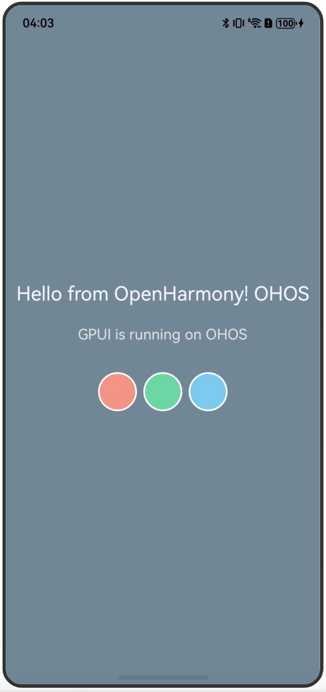

# GPUI-DEMO




## Setup

Clone gpui-demo and openharmony-ability

```bash
git clone https://github.com/richerfu/gpui-demo.git
git clone https://github.com/harmony-contrib/openharmony-ability.git
```

## Build

build gpui-demo

ohrs >= 1.3.1

```bash
RUSTFLAGS=$(printf '--cfg\x1fgles') ohrs build --arch aarch
```

## Run

Open openharmony-ability/xcomponent_example with DevEco.

Change `src/main/ets/entryability/EntryAbility.ets` to the following code:
```ts
import { RustAbility } from "@ohos-rs/ability";
import Want from "@ohos.app.ability.Want";
import { AbilityConstant } from "@kit.AbilityKit";
import window from "@ohos.window";

export default class EntryAbility extends RustAbility {
  public moduleName: string = "hello";
  public defaultPage: boolean = true;

  async onCreate(want: Want, launchParam: AbilityConstant.LaunchParam): Promise<void> {
    super.onCreate(want, launchParam);
  }

  async onWindowStageCreate(windowStage: window.WindowStage): Promise<void> {
    const window = windowStage.getMainWindowSync();
    await window.setWindowLayoutFullScreen(true);
    super.onWindowStageCreate(windowStage);
  }
}
```

Copy `gpui-demo/dist/arm64-v8a/libhello.so` to `xcomponent_example/entry/libs/arm64-v8a`.

Run it.